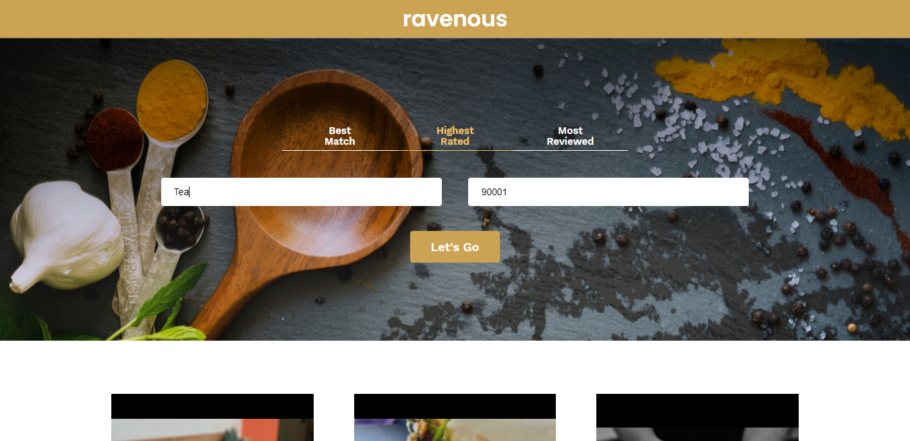

# Ravenous restaurant search app
A ReactJs app to search restaurants based on location and business name. App users Yelp API to get businesses data.
Native Fetch API is used to make requests to Yelp API.

## Built With

- HTML
- CSS
- ReactJs
- Firebase
- Yelp API

## Live Demo

[Live Demo Link](https://ravenous-ec192.web.app/)

## Getting Started

To get a local copy up and running follow these simple example steps.

### Prerequisites

You should have installed git on your local machine and a code editor preferably VS Code.

### Setup

- Clone the repository into your local machine
- `cd` into cloned repository
- Run `npm install` to download dependencies
- Run `npm start` to run app on local machine

## Authors

👤 **Author**

- Github: [@alishabab](https://github.com/alishabab)
- Twitter: [@shabab_ali](https://twitter.com/shabab_ali)
- Linkedin: [Shabab Ali](https://www.linkedin.com/in/shababali/)

## 🤝 Contributing

Contributions, issues and feature requests are welcome!

Feel free to check the [issues page](issues/).

## Show your support

Give a ⭐️ if you like this project!

## Acknowledgments

- [Yelp](https://www.yelp.com/)
- [Codecademy](https://www.codecademy.com/)

## 📝 License

This project is [MIT](lic.url) licensed.
